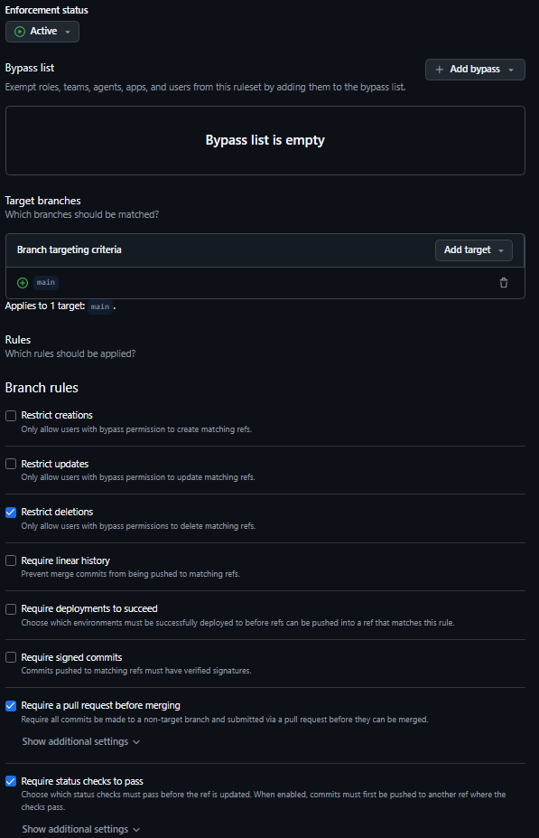

# Curriculo Online - DS881

Projeto individual da disciplina DS881 com um curriculo online publicado via GitHub Pages, ambiente local conteinerizado com Docker e pipeline CI/CD usando GitHub Actions.

## Link em producao

O curriculo esta publicado em:

https://henriqueramos00.github.io/ds881-curriculo-GRR20240450/

## Tecnologias utilizadas

- Vue 3
- TypeScript
- Vite
- Docker
- Docker Compose
- GitHub Actions
- GitHub Pages

## Execucao local com Docker

Esta aplicacao pode ser executada localmente sem instalar Node.js diretamente na maquina. O ambiente de desenvolvimento e criado a partir do `Dockerfile`, e o `docker-compose.yml` inicia o servidor do Vite dentro do container.

### Pre-requisitos

- Docker instalado
- Docker Compose instalado

### Subir o ambiente

Na raiz do repositorio, execute:

```bash
docker compose up --build
```

O comando acima:

- constroi a imagem com base em `node:22-alpine`;
- instala as dependencias com `npm ci`;
- inicia o servidor de desenvolvimento com `npm run dev -- --host 0.0.0.0`;
- mapeia a porta `5173` do container para a porta `8080` da maquina local;
- monta o diretorio do projeto em `/app`, permitindo hot reload ao salvar alteracoes nos arquivos.

Depois que o container estiver em execucao, acesse:

http://localhost:8080

### Parar o ambiente

Para parar os containers, pressione `Ctrl+C` no terminal em que o Compose esta rodando.

Se preferir parar em outro terminal, execute:

```bash
docker compose down
```

### Reinstalar dependencias do container

Caso haja alteracoes em `package.json` ou `package-lock.json`, reconstrua a imagem:

```bash
docker compose up --build
```

### Executar comandos dentro do container

Com o ambiente em execucao, e possivel executar comandos dentro do servico `app`:

```bash
docker compose exec app npm run lint
docker compose exec app npm run build
```

## CI/CD

O workflow esta configurado em `.github/workflows/main.yml` e executa:

- linter e analise estatica em Pull Requests para `main` e em pushes na `main`;
- build da aplicacao;
- deploy automatico para GitHub Pages apos alteracoes integradas na branch `main`.

## Protecao da branch main

A branch `main` possui uma ruleset de protecao ativa no GitHub. A configuracao aplicada inclui:

- ruleset com status `Active`;
- criterio de alvo aplicado a branch `main`;
- lista de bypass vazia;
- restricao para impedir delecao da branch;
- obrigatoriedade de Pull Request antes do merge;
- obrigatoriedade de status checks aprovados antes da atualizacao da branch.

Evidencia da configuracao:


